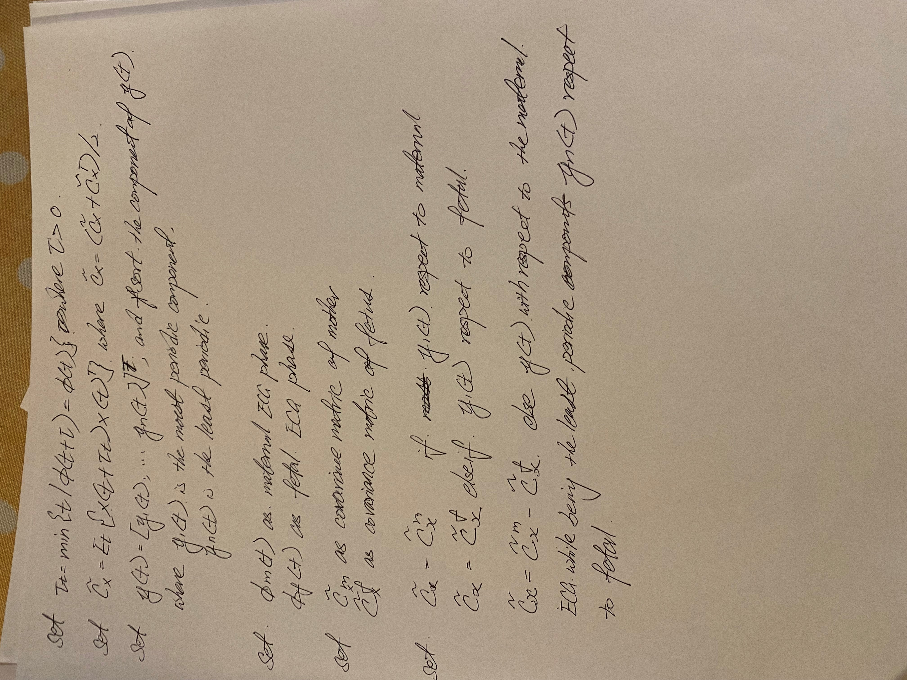

# BSS Lecture Codes
### Xueyun Liu 
### xliu336@emory.edu

### Question 1
#### Part A

#### Part B

### Question 2
#### Part A

#### Part B

### Question 3
For the Ex01 file the date get decorrelated by eigenfunction. Once decorrelate the channel, it keep the most decorrelated and powerful sources with the highest eigenvalue and throw off any the less important ones.  The threshold is one of the parameter that we can change. For example, if the threshold is 99.9% which mean that we keep the 99.9% energy of the signal and we want to find the threshold above which the remaining error between the reconstructed signal and the original signal would be 0.1%.  The energy of the signal is importance for the PCA, since PCA only interested in keep the energy of signal and finding the linear combination of the observation, which would be represent the signal energy in the second order of statistic term.  The PCA doesn’t care about the clinically significant nor the shape nor care about what it throw away.  It just looking at the energy of the components and keeping the one with the highest energy.  The problem for the PCA is that it only care about keeping energy so does not guarantee by applying dimension reduction through PCA.  So in case like getting the ECG for the fetal, the PCA might throw away those weak energy signal and they might be the signal that we are interested.  
Ex02 file is power method to calculate the dominant eigenvalue. It start with covariance matrix A, and with an initial guess for the eigenvector of the dominant eigenvalue.  I multiply the most recently obtained vector on the left by A, normalize the result, and repeat the process until the answers converge to the desired eigenvector. If convergence occurs, the norm of the final vector is the absolute value of the dominant eigenvalue. 
Ex03 file is the comparison of ICA methods, which are FASTICA, JADE, and SOBI. For the FASTICA method, it has two approach, symmetric and the deflation.  The deflation is the method that extract source one by one, and the symmetric is instead of extract the source one by one, it will come up with a matrix all at once.  JADE algorithm use the real jade function for a matrix, and select an eigenvalue that we want to preserve and it will internally do the dimension reduction or give us many source that we have. The SOBI algorithm is the linear algebra method. The function estimate the unmixing matrix in a second order stationary source separation model by jointly diagonalizing the covariance matrix and several autocovariance matrices at different lags. 

### Question 4 
Paper: “Multichannel electrocardiogram decomposition using periodic component analysis.” 
Summary: Electrocardiogram (ECG) has rich signal information in the temporal structure.  So it is more appreciate to measure extracted signal periodically from both clinically and mathematically than independence.  Therefore, the independent component analysis (ICA) is not ideal method to use to analysis the ECG recording.  The idea of this method is to find any periodic structure that can be synchronous with the reference ECG R peaks extracted from a suitably clean ECG reference. In this paper they are using this method to remove maternal ECG artifacts from fetal ECG recordings. This paper proposed use periodic component analysis (πCA) to generate this generalized eigenvalue decomposition for the decomposition the multichannel ECG recoding, so it can extract a periodic components for a certain desired ECG signal from a set of multichannel recording. ECG have RR-period deviation of up to 20%; therefore, we cannot use constant period π to describe the ECG’s periodicity.  This is detected by R-peaks of ECG, a linear phase φ(t) ranged from –π to π for each ECG sample, with the R peak being fixed at φ(t) = 0.  Then the constant time lag τ need to updated to the time-lag τt which is calculated from φ(t) from beat to beat as well.  Then the generalized eigenvalue decomposition (GEBD) pair with the eigenvector ranked corresponding generalized eigenvalue in descending order.  The desired signal vector is sorted according to the amount of their periodicity with respects to R-peaks of ECG. Then the covariance matrices of mother and fetus is assigned.  And finally, the matrix used in the GEVD is set to maternal matrix if the most periodic components with respect to the maternal ECG, or the matrix set to fetal matrix if the most periodic components with respect to the fetal ECG, or set to the maternal matrix subtract from fetal matrix if the most periodic components with respect to the maternal ECG while being the least periodic components with respect to the fetal ECG.  
### Pseudo-code

