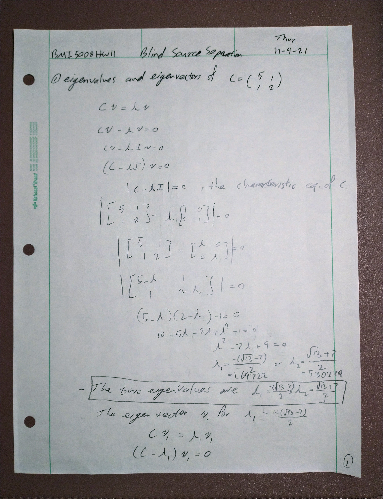
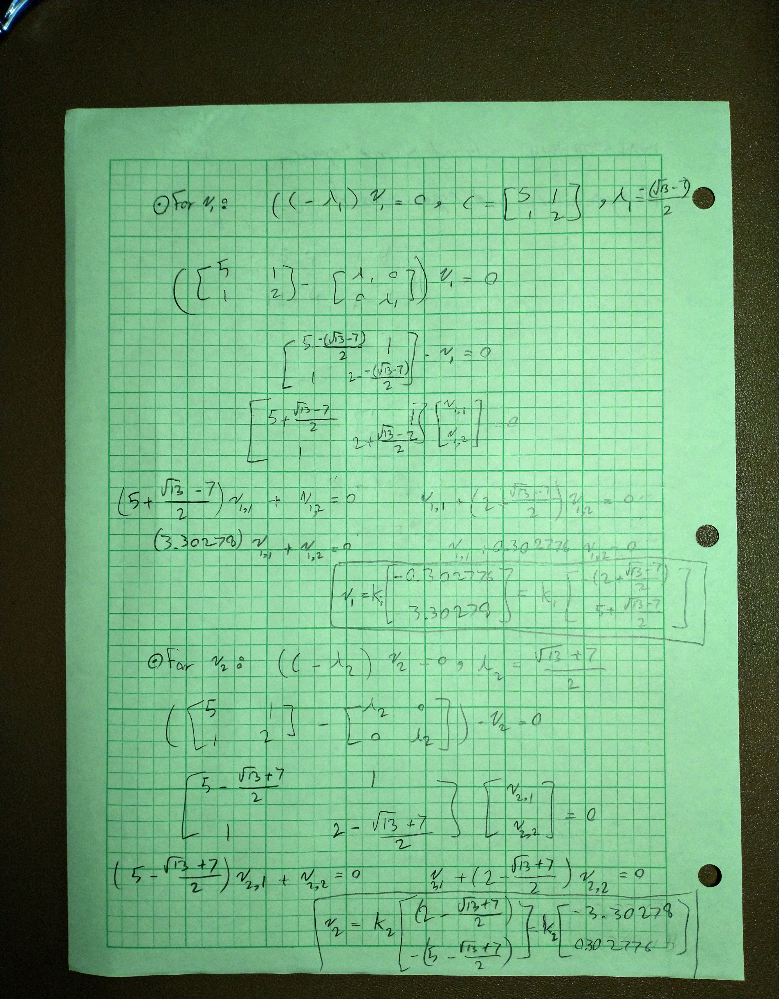

# BSS Lecture Codes
## Reza Sameni
## Emory University Department of Biomedical Informatics

A short lecture of blind-source separation algorithms with practical examples in Matlab
### Student Name: Sina Dabiri
### Student Email: sdabiri@emory.edu
***
### Question 1
#### Part A

#### Part B
The Matlab implementation:
>> C = [[5,1];[1,2]]
>> [vec,val]=eig(C)
vec =
    0.2898   -0.9571
   -0.9571   -0.2898
val =
    1.6972         0
         0    5.3028

Note the ratio of 0.9571/0.2898=3.3026 and 0.2898/0.9571=0.30279 are similar to the ratios we got (3.30278, and 0.302776). This is because the results are not unique but their ratio is.

#### Part C
[Your report]
…
***
### Question 2
#### Part A
[Your report]
