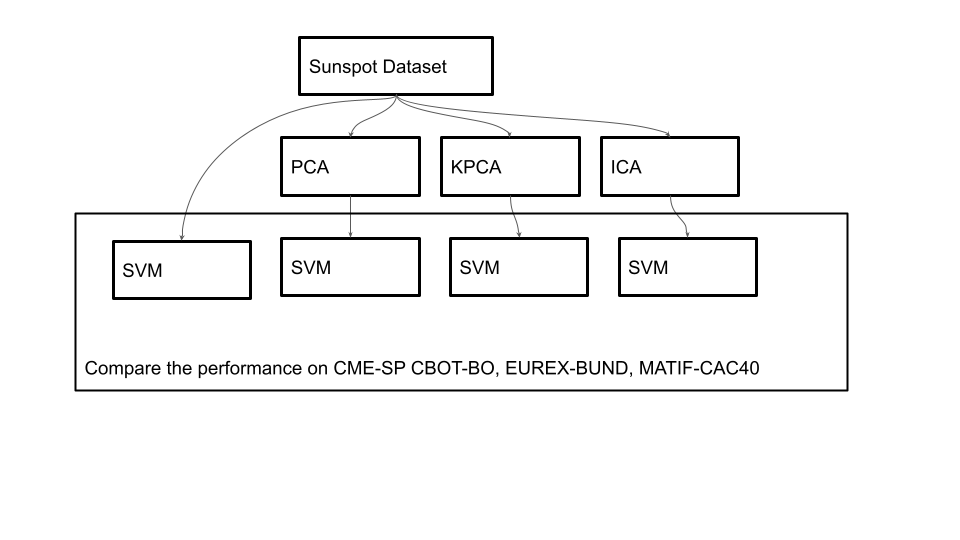

# BSS Lecture Codes
## Reza Sameni
## Emory University Department of Biomedical Informatics

A short lecture of blind-source separation algorithms with practical examples in Matlab
### Student Name: Mingzhe Hu   
### Student Email: mhu58@emory.edu  
***
### Question 1  
##### Part A    
  

##### Part B  
  
As we can see that Part A and Part B have the same result.  
  
### Question 2
#### Part A & B  
```matlab
function [v,lambda] = EigenAnalysisPowerMethod(A, v0, N)
% An implementation of the Power method for eigenvalue decomposition and
% visualization
%
% Inputs:
%   A: A square matrix
%   v0: An initial non-zero (random) vector, which matches in dimension with A
%   N: The number of power iterations
% Output:
%   v: An estimate of the leading eigenvalue after N iterations
%
% Mingzhe Hu
% Nov 2021

%initial vector
v = v0(:);
f1 = figure;
f2 = figure;
for k = 1 : N
    set(0, 'CurrentFigure', f2)
    %figure(2)
    txt = ['Iteration = ',num2str(k)];
    plot(v, 'DisplayName', txt);
    title("Principle  Eigenvector")
    legend("show", "Location", "eastoutside");
    hold on;
    v = A * v;
    y = A*v;
    l=y'*v;
    m=v'*v;
    % eigenvalue
    lambda =l/m;
    % approximate the next eigenvectvor
    %figure(1)
    set(0, 'CurrentFigure', f1)
    plot(k,lambda,'*b');
    title("Principle Eigenvalue")
    hold on;
    v = v / sqrt(v' * v);
end
disp(["Principle Eigenvalue:", num2str(lambda)]);
disp("Principle Eigenvector:");
disp(-v);
```
Principle Eigenvalue: 5.3028  
Principle Eigenvector: [0.9571, -0.2898]  
 
 
  
### Question 3  
#### Part A & B  
The changes are made directly on the original files.  
###### Ex01  
In this example. The parameter we changed is the ECG signal with the signal source changed from one to two. We compressed the signal through principal component analysis. First, a low-pass filter removes the low-pass component of the signal and makes the average value of all signal channels become zero. Then we calculated the covariance matrix of the signal and extracted the eigenvalues ​​and eigenvectors. By sorting the eigenvalues, we use a threshold to retain only the eigenvalues ​​with the most information. The compressed data still retains most of the information of the original signal.
  
##### Ex02  
This example shows us how to approximate the main eigenvalues ​​and eigenvectors of the signal through the power method. We observe the influence of the number of iterations on the approximation result of the power function method by changing the number of iterations. Found after observation. When the number of iterations is small, it has not yet converged, so the error of the calculated results may be relatively large. If there are too many iterations, it may have converged long ago. This will take too much calculation time. A better way is by setting a minimum error condition. Stop the iteration when the error is less than this threshold. In this way, the entire cycle can be precisely controlled.
  
##### Ex03
In this example, we run SOBO,  FastICA,and JADE. The difference of performance is observed and compared. After going through some literature reviews, here is my the conclusion of their dofference: SOBI → gives the fastest result → with not much difference → also does not take too much memory. (this might be due to good implementation). (Fast ICA → good initialization is needed → also not stable). Fast ICA → heavily depends on the initialization → running time might be slow → but Fast ICA → can be parallel. (JADE → less memory). )SOBI → cannot be parallelized easily.  
Reference: https://www.researchgate.net/publication/316940677_A_Comparison_of_SOBI_FastICA_JADE_and_Infomax_Algorithms
  
##### Ex04
This script compared two different algorithms JADE and NSCA on removing the EOG signal from EEG signal. Here, I changed the frequency parameter of the original script.
The algorithm assumes that the signal collected at each electrode actually includes the EEG information and artifact information at the location of all electrodes, and these information are independent of each other, but due to distance, EEG signals from other electrodes are arriving at this location. The electrodes have been attenuated, so the signal of each electrode can be decomposed into different components through an algorithm, and then the artifact components are removed from these components, and they are synthesized into a new signal. Only useful EEG information is left. ICA is often used for the removal of ECG and ocular artifacts. The denoised channels result are plotted for JADE and NSCA seperately. From the results, we can observe that the JADE and NSCA have slightly different sensitivity on different EOG channels.  
  
##### Ex05  
This script is directly imported form the OSET/testPrograms. There is no place to change the parameters or change the the test data. Noninvasive fetal ECG monitoring makes use of electrodes placed on the mother's abdomen with sophisticated algorithms to separate fetal and mother activity. In this task often Blind Source Separation is used as an intermediate step. To solve Blind Source Separation problem is generally employed PCA and ICA. In this script, different method like PiCA, JADE and SOBI are compared. By plotting the results, it seems that the JADE method has the best performance.  
  
### Question 4  
##### Paper: A comparison of PCA, KPCA and ICA for dimensionality reduction in support vector machine  
&nbsp;&nbsp;&nbsp;&nbsp;Support vector machine is a popular machine leaening method in time series forecasting. However, the performance of SVM on high dimensional data is pretty bad. Bedore conducting SVM, the first step is feature extraction.When we try to use machine learning to solve practical problems on our own, the biggest problem we encounter is often not an algorithm problem, but a data problem. Sometimes we will be troubled by the lack of data, and sometimes we will fall into "happiness" because of too much data.  
&nbsp;&nbsp;&nbsp;&nbsp;When learning algorithms before, we can see that many algorithms involve distance calculation, and high-dimensional space will bring great trouble to distance calculation. In fact, problems such as sparse data samples and difficulty in distance calculations in high-dimensional situations are serious obstacles faced by all machine learning methods, which are called "dimensional disasters, dimensional curses, dimensional crises, etc."  
&nbsp;&nbsp;&nbsp;&nbsp;This paper compared several popular dimensionality reduction method - PCA, KPCA and ICA, and discussed how they improve the performance of SVM.  
  
&nbsp;&nbsp;&nbsp;&nbsp;PCA: What PCA actually does is to find a low-dimensional space that can retain a lot of information after the original high-dimensional data is projected. PCA believes that such a space and hyperplane should probably have similar properties:  
　　　● Nearest reconstruction: The distance between the sample points and the hyperplane is close enough, which means that the sample points move as little as possible.  
　　　● Maximum separability: The projections of the sample points on the hyperplane are separated as much as possible, because the more the division, the greater the variance, the more information is contained.  
&nbsp;&nbsp;&nbsp;&nbsp;KPCA: Although PCA is often effective, it has a big flaw: it is linear dimensionality reduction, and it often has a poor effect on nonlinear data. In order to overcome this problem, an algorithm called Kernel Principal Component Analysis (KPCA) is proposed to solve the nonlinear problem. It uses kernel tricks. The basic idea is: implicitly map data to high-dimensional linearly separable spaces, and use kernel functions for processing without knowing the specific form of the mapping function.  
&nbsp;&nbsp;&nbsp;&nbsp;ICA: General dimensionality reduction methods, such as PCA, LDA, and FA, are based on the assumption that the observed data points are Gaussian distribution models. On the premise that the observed data sets are non-Gaussian distribution models, PCA and LDA The dimensionality reduction effect is not good; ICA is suitable for non-Gaussian analysis data sets and is an effective extension of principal component analysis (PCA) and factor analysis (Factor Analysis).  
Below are implementation of ICA, PCA, KPCA from scratch in python:  
ICA:  
```python
def fastIca(signals,  alpha = 1, thresh=1e-8, iterations=5000):
    m, n = signals.shape

    # Initialize random weights
    W = np.random.rand(m, m)

    for c in range(m):
            w = W[c, :].copy().reshape(m, 1)
            w = w / np.sqrt((w ** 2).sum())

            i = 0
            lim = 100
            while ((lim > thresh) & (i < iterations)):

                # Dot product of weight and signal
                ws = np.dot(w.T, signals)

                # Pass w*s into contrast function g
                wg = np.tanh(ws * alpha).T

                # Pass w*s into g prime
                wg_ = (1 - np.square(np.tanh(ws))) * alpha

                # Update weights
                wNew = (signals * wg.T).mean(axis=1) - wg_.mean() * w.squeeze()

                # Decorrelate weights              
                wNew = wNew - np.dot(np.dot(wNew, W[:c].T), W[:c])
                wNew = wNew / np.sqrt((wNew ** 2).sum())

                # Calculate limit condition
                lim = np.abs(np.abs((wNew * w).sum()) - 1)

                # Update weights
                w = wNew

                # Update counter
                i += 1

            W[c, :] = w.T
    return W
```  
PCA:  
```Python
import numpy as np
from numpy import linalg as LA


def compute_Z(X, centering=True, scaling=True):
    # copying X because need a float type
    Z = X.astype(float)

    # shapes
    rows = Z.shape[0]
    cols = Z.shape[1]

    if centering:
        # means calculation for centering
        means = X.mean(0)
        for i in range(rows):
            for j in range(cols):
                Z[i, j] = Z[i, j] - means[j]

    # scaling with std dev
    if scaling:
        std = np.std(Z, axis=0)
        for i in range(cols):
            for j in range(rows):
                Z[j][i] = Z[j][i] / std[i]  # standardize every feature

    return Z


def compute_covariance_matrix(Z):
    return Z.T.dot(Z)


def find_pcs(COV):
    eigenValues, eigenVectors = LA.eig(COV)
    idx = eigenValues.argsort()[::-1]
    eigenValues = eigenValues[idx]
    eigenVectors = eigenVectors[:, idx]

    return eigenValues, eigenVectors


def project_data(Z, PCS, L, k, var):
    eigen_pairs = [(np.abs(L[i]), PCS[:, i]) for i in range(len(L))]
    eigen_pairs.sort(key=lambda x: x[0], reverse=True)

    # copy of components could be useful
    component_matrix = np.copy(PCS)
    if k != 0:
        # delete unnecessary components
        component_matrix = np.delete(component_matrix, range(k, component_matrix.shape[1]), axis=1)
        Z_star = Z.dot(component_matrix)

    else:
        print()
        tot_var = 0
        eigen_val_index = 0
        while tot_var < var:
            tot_var = tot_var + L[eigen_val_index] / np.sum(L)
            eigen_val_index = eigen_val_index + 1
        component_count = eigen_val_index
        component_matrix = np.delete(component_matrix, range(component_count, component_matrix.shape[1]), axis=1)
        Z_star = Z.dot(component_matrix)
    return Z_star
```  
KPCA:  
```python
from scipy.spatial.distance import pdist, squareform

from scipy import exp

from scipy.linalg import eigh

import numpy as np 

def rbf_kernel_pca(X, gamma, n_components):

    """
    RBF kernel PCA implementation.    

    Parameters
    ------------
    X: {NumPy ndarray}, shape = [n_examples, n_features]  

    gamma: float

        Tuning parameter of the RBF kernel    

    n_components: int

        Number of principal components to return    

    Returns
    ------------
    X_pc: {NumPy ndarray}, shape = [n_examples, k_features]

        Projected dataset   

    """

    # Calculate pairwise squared Euclidean distances

    # in the MxN dimensional dataset.

    sq_dists = pdist(X, 'sqeuclidean')    

    # Convert pairwise distances into a square matrix.

    mat_sq_dists = squareform(sq_dists)    

    # Compute the symmetric kernel matrix.

    K = exp(-gamma * mat_sq_dists)    

    # Center the kernel matrix.

    N = K.shape[0]

    one_n = np.ones((N,N)) / N

    K = K - one_n.dot(K) - K.dot(one_n) + one_n.dot(K).dot(one_n)    

    # Obtaining eigenpairs from the centered kernel matrix

    # scipy.linalg.eigh returns them in ascending order

    eigvals, eigvecs = eigh(K)

    eigvals, eigvecs = eigvals[::-1], eigvecs[:, ::-1]    

    # Collect the top k eigenvectors (projected examples)

    X_pc = np.column_stack([eigvecs[:, i]
                           for i in range(n_components)])    

    return X_pc
```  
References:  
[1] https://github.com/akcarsten/Independent_Component_Analysis  
[2] https://github.com/dauut/pca-from-scratch/blob/master/pca.py  
[3] https://opendatascience.com/implementing-a-kernel-principal-component-analysis-in-python/  
[4] Cao, L. J., et al. "A comparison of PCA, KPCA and ICA for dimensionality reduction in support vector machine." Neurocomputing 55.1-2 (2003): 321-336.
