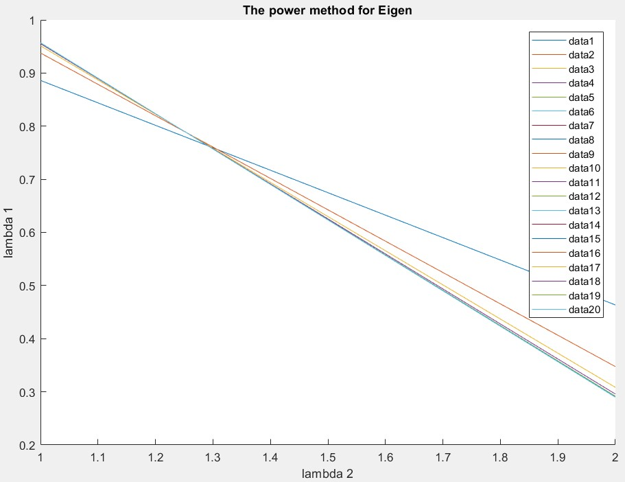

# BSS Lecture Codes
## Reza Sameni
## Emory University Department of Biomedical Informatics

A short lecture of blind-source separation algorithms with practical examples in Matlab
### Student Name: Sina Dabiri
### Student Email: sdabiri@emory.edu
***
### Question 1
#### Part A


#### Part B
The Matlab implementation:
```install
>> C = [[5,1];[1,2]]
>> [vec,val]=eig(C)
vec =
    0.2898   -0.9571
   -0.9571   -0.2898
val =
    1.6972         0
         0    5.3028

```
Note the ratio of 0.9571/0.2898=3.3026 and 0.2898/0.9571=0.30279 are similar to the ratios we got (3.30278, and 0.302776). This is because the results are not unique but their ratio is.

***
### Question 2
#### Part A
```install
>> v0 = rand(2, 1);
>> v20 = EigenAnalysisPowerMethod([[5,1];[1,2]], v0, 20)
v20 =
    0.9571
    0.2898
```
#### Part B
This is an adaptation of Dr. Sameni's EigenAnalysisPowerMethod for N=20:
```install
[n,~] = size(A);
v0 = rand(n,1);

V = zeros(n,N);
v = v0(:); % initial vector

for k = 1 : N
    v = A * v;
    v = v / sqrt(v' * v);
    V(:,k) = v;
end


%% Plotting
figure(1)
% plot(1:N,V(:,1:N))
hold on
for p=1:N
    plot(V(:,p));
    legend();
end
hold off
title('The power method for Eigen');
xlabel('lambda 2');
ylabel('lambda 1');

```
To run we give it an nxn matrix A and the iterations, in this case 20:
```install
>> A = [[5,1];[1,2]]
A =
     5     1
     1     2
>> V = SinaEigenAnalysisPowerMethod(A, N)
V =
    0.9571
    0.2898

```

***
### Question 3
#### Part A
##### Ex01
ECG from Physionet PTB database patient1 record s0014lre (channel 1 to 14) was used. The eigen vectors and values are: 
```install
>> [V, D] = eig(Cx, 'vector')
V =
  Columns 1 through 12
   -0.0064    0.0364   -0.2606   -0.7415    0.0043   -0.0022    0.0320    0.0746   -0.0964    0.1406   -0.4075    0.3583
   -0.0167   -0.0384   -0.6258    0.4751    0.0172   -0.0869   -0.0932    0.0349   -0.3243    0.0540   -0.3341    0.2039
   -0.0623   -0.7058    0.1014   -0.3266    0.0130   -0.0846   -0.1257   -0.0398   -0.2277   -0.0866    0.0734   -0.1545
   -0.5902    0.0502   -0.5768   -0.1750   -0.0106    0.0447    0.0303   -0.0548    0.2105   -0.0973    0.3708   -0.2812
   -0.6121   -0.4433    0.2554    0.2790   -0.0045    0.0411    0.0791    0.0572    0.0655    0.1136   -0.2405    0.2564
   -0.5223    0.5477    0.3636   -0.0965    0.0152   -0.0858   -0.1095   -0.0024   -0.2760   -0.0163   -0.1304    0.0247
   -0.0000   -0.0000    0.0000    0.0001    0.0330   -0.1667   -0.0838    0.1242    0.2199    0.4568   -0.4611   -0.6869
   -0.0000    0.0001   -0.0001   -0.0002   -0.3248    0.0302    0.3675   -0.5271   -0.4742    0.1790    0.0917   -0.2107
    0.0000   -0.0001    0.0001    0.0002    0.5462    0.1441   -0.3331   -0.1694    0.0147   -0.3412   -0.0576   -0.1042
   -0.0000    0.0000   -0.0001   -0.0001   -0.5743   -0.1328    0.0095    0.5247    0.1110   -0.2956    0.0384   -0.0238
    0.0000   -0.0000   -0.0000   -0.0002    0.4208    0.0780    0.5773    0.3179    0.0779    0.3611    0.2510    0.1219
    0.0000    0.0000    0.0001    0.0002   -0.2840    0.6440   -0.3534   -0.1576    0.2674    0.4012    0.0730    0.1682
   -0.0000    0.0000   -0.0001    0.0001   -0.0256   -0.6965   -0.2269   -0.3183    0.3107    0.2824    0.2297    0.2962
   -0.0000    0.0000   -0.0000   -0.0001   -0.0778    0.0365    0.4388   -0.4011    0.4991   -0.3627   -0.3971    0.0471
  Columns 13 through 14
    0.0282   -0.2234
    0.1579    0.2774
    0.1297    0.5009
   -0.0931   -0.0270
   -0.0507   -0.3621
    0.1438    0.3891
    0.0810   -0.0264
    0.3058   -0.2784
    0.5616   -0.3083
    0.5132   -0.1099
    0.3708    0.1749
    0.2321    0.1871
    0.2115   -0.0062
    0.1030    0.2967
D =
    0.0000
    0.0000
    0.0000
    0.0000
    0.0000
    0.0001
    0.0002
    0.0003
    0.0007
    0.0012
    0.0053
    0.0756
    0.2124
    0.2330
```


##### Ex02
```install
V =
  Columns 1 through 12
   -0.0065   -0.0235   -0.1584   -0.7704   -0.0018   -0.1654   -0.0398    0.2101   -0.2350   -0.2925    0.3830    0.1238
   -0.0188    0.0340   -0.6839    0.3870   -0.0140   -0.1834    0.0296    0.1408   -0.3765    0.0229    0.1835   -0.1057
   -0.0529    0.7111    0.1463   -0.2985   -0.0123   -0.0180    0.0693   -0.0695   -0.1414    0.3155   -0.1996   -0.2295
   -0.5923   -0.0376   -0.5462   -0.2524    0.0079    0.1744    0.0051   -0.1755    0.3058    0.1348   -0.2833   -0.0090
   -0.6063    0.4451    0.2185    0.3175    0.0053   -0.0737   -0.0545    0.1398   -0.0468   -0.3040    0.2914    0.1766
   -0.5276   -0.5414    0.3737   -0.0559   -0.0132   -0.1007    0.0494    0.0357   -0.2590    0.1692   -0.0080   -0.1676
    0.0000    0.0000   -0.0000   -0.0000    0.2383   -0.2371    0.2831    0.4337    0.0793   -0.3657   -0.5329    0.2000
   -0.0000   -0.0000    0.0000    0.0001   -0.5082    0.1241   -0.0617   -0.4776   -0.2821   -0.2537   -0.1408    0.4504
    0.0000   -0.0000   -0.0000   -0.0000    0.5407   -0.1741   -0.2208   -0.2424   -0.0132    0.1807   -0.0759    0.6043
   -0.0000    0.0000    0.0000   -0.0000   -0.4875    0.0903    0.2643    0.4561    0.2241    0.3729    0.0536    0.4477
    0.0000    0.0000   -0.0000   -0.0001    0.2763    0.6267   -0.2852    0.2730    0.0047    0.1452    0.2536    0.1473
   -0.0000   -0.0000    0.0000    0.0001   -0.1304   -0.6037   -0.2872   -0.0645    0.4198    0.2394    0.2594    0.0356
   -0.0000   -0.0000   -0.0000   -0.0001    0.2399    0.0394    0.7836   -0.3305    0.1089    0.0513    0.3949    0.0867
    0.0000    0.0000   -0.0000   -0.0000   -0.0581    0.1547   -0.0831   -0.0933    0.5440   -0.4736    0.1206   -0.1503
  Columns 13 through 14
    0.0688   -0.0142
   -0.0293    0.3721
   -0.0981    0.3863
   -0.0198   -0.1790
    0.0835   -0.2002
   -0.0637    0.3792
   -0.3809    0.0981
   -0.3334    0.1288
    0.3191    0.2535
    0.2436    0.1563
   -0.5055    0.1114
   -0.4795   -0.0008
   -0.1987    0.0125
    0.1761    0.6072
D =
  Columns 1 through 12
    0.0000         0         0         0         0         0         0         0         0         0         0         0
         0    0.0000         0         0         0         0         0         0         0         0         0         0
         0         0    0.0000         0         0         0         0         0         0         0         0         0
         0         0         0    0.0000         0         0         0         0         0         0         0         0
         0         0         0         0    0.0015         0         0         0         0         0         0         0
         0         0         0         0         0    0.0065         0         0         0         0         0         0
         0         0         0         0         0         0    0.0086         0         0         0         0         0
         0         0         0         0         0         0         0    0.0132         0         0         0         0
         0         0         0         0         0         0         0         0    0.0340         0         0         0
         0         0         0         0         0         0         0         0         0    0.1212         0         0
         0         0         0         0         0         0         0         0         0         0    0.1590         0
         0         0         0         0         0         0         0         0         0         0         0    0.2980
         0         0         0         0         0         0         0         0         0         0         0         0
         0         0         0         0         0         0         0         0         0         0         0         0
  Columns 13 through 14
         0         0
         0         0
         0         0
         0         0
         0         0
         0         0
         0         0
         0         0
         0         0
         0         0
         0         0
         0         0
    2.3544         0
         0    6.2678
lambda1 =
    6.2678
lambda2 =
    2.3544
lambda3 =
    0.2980
>> 
```
***
#### Part B

##### Ex01:
The Ex01_testPCA does principal component analysis on a physiological signal. I chose patient 1 record s0014lre of the Physionet PTB database. First baseline is removed using a low pass filter. Then raw signals are plotted. Then channel means are removed to correct the baseline. The demeaned signal is then plotted. The eigenvectors and eigenvalues are calculated using the matlab eig function. Then using the eigenvectors the signal is decorrelated and plotted. In addition, the partial energy in each eigenvalue is calculated and the ones that represent 99.9 % energy are kept, in my dataset’s case there were the top 6 eigenvalues.

##### Ex02:
The Ex02_testEigenAnalysisPowerMethod calculates the eigenvalues using the power method. 
I used the same dataset as in exercise 1. This script does 100 iterations for calculating the eigens and reports the top three lambdas. For the previous problem, problem 2, I edited the function to iterate through 20 values and plotted vectors representing the two top eigenvalues. In the plot and the values we see as the number of iterations increase the values of the lambdas become more accurate and closer to matlab’s eig function. 

##### Ex03:
The Ex03_testICAmethods calculates the independent component analysis for the ECG dataset I have been working on. First baseline is removed using a low-pass filter and the raw signal is plotted. Then Fast ICA is performed. The approach used is ‘symm’ rather than ‘defl’ (similar to power method), the non-linear transformation is ‘tanh’, and iterative PCA is not used. In addition, the following Algebraic Blind source separation and approximate joint matrix diagonalization methods of JADE and SOBI are used. The Fast ICA, JADE and SOBI amplitude, sign and order of channels are different. 

##### Ex04:
