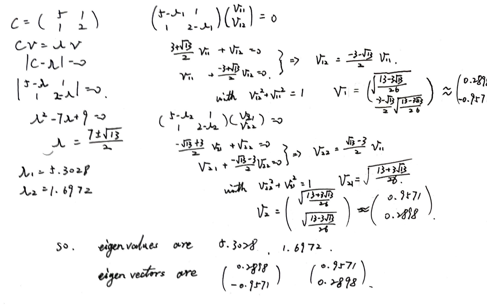
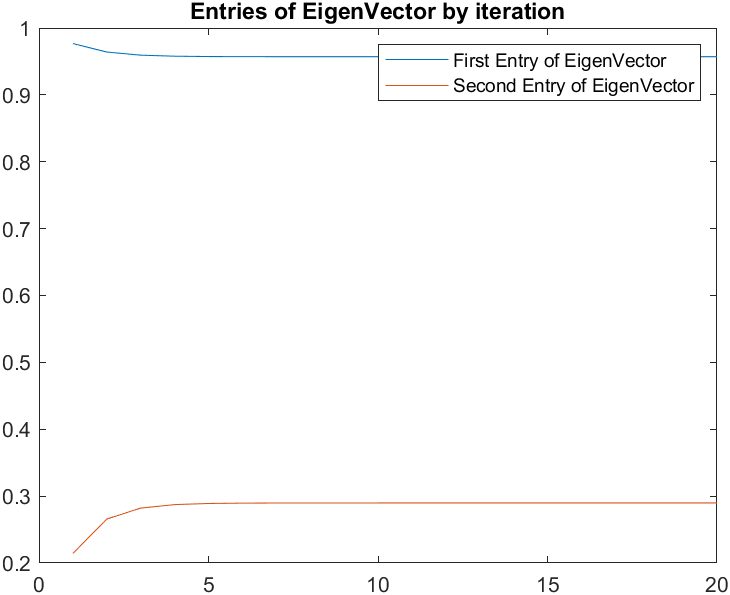
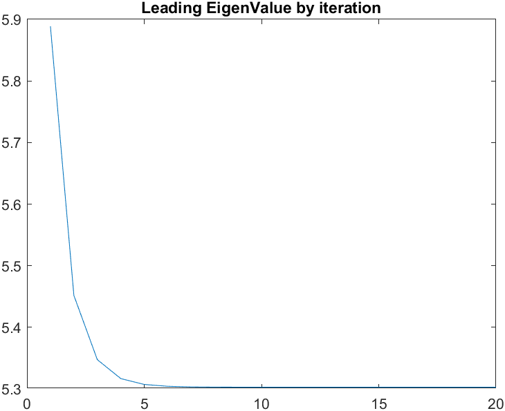

# BSS Lecture Codes
## Reza Sameni
## Emory University Department of Biomedical Informatics

A short lecture of blind-source separation algorithms with practical examples in Matlab

# BMI500_HW11_BlindSourceSeperation

### Student Name: Chenbin Huang
### Student Email: chenbin.huang@emory.edu
***
### Question 1
#### Part A


#### Part B

```
c = [5,1 ; 1,2];
[V,D] = eig(c)

% V =
%
%     0.2898   -0.9571
%    -0.9571   -0.2898
% 
% 
% D =
% 
%     1.6972         0
%          0    5.3028
```
Results are the same. (sign doesn't matter to eigen vector)

### Question 2
#### Part A
Result is trhe same as  calculated before.
Script is `./ChenbinHuang/q2.m`.  
Result is :
```
v1 =
    0.9571
    0.2898

lambda1 =
    5.3028

v2 =
    0.2898
   -0.9571

lambda2 =

    1.6972
```
#### Part B
The change of entries of eigen vector is shown in the following figure:  


The change of the leading eigenvalueis shown in the following figure:



***
### Question 3
#### Part A
- EX01:  
Use `EEGdata2`; change `threshold` to 90.
- Ex02:  
Change `N` to 5 and `T` to 1500
- Ex03:  
Use `EEGdata2` instead of generated signal.
`approach` to `defl`, `num_cov_matrices` to 20
- Ex04:
change  eog channel numbers
- Ex05:
testPCAICAPiCAfECGDenoising


#### Part B
##### Ex01:  
In this example, PCA is done on the signals. The de-meaned signals are decomposed by eigenvalues and each channel is decorrelated.  
The principal components are featured by the eigens. Rank the eigen values from high to low, their cumulative value divide by the total enerygy(variance of signals) reflects the energy, applying the threshold to the select the number of the eigenvalues i.e. number of pricipal components. The signal restord from the choosen PCs/eigens reflects the loss of the information in the original signal after selection of PC.
Based on the values of energy, high threshold (100) would lead to the selection of all eigen values, and make exactly the same signal(not compressed much). As the threshold drop, the restored signals negin to lose information. When threshold is low enough (e.g. 50 in this example), the restored signal would be all 0.  
With a 90 threshold, only the first leading eigen component is kept. Based on the restored image, it can be seen that the signal varies from the original signal, however, most important information is restored.

##### Ex02
In this Example, the iterative Power method is used to calculate the eigenvalue of the covariance matrix of the signal, and the result is compare with the result from the built-in `eig` function.  
Main idea is that init a random "eigen vector" at first, and update it iteratively to the eigenvector. Within each iteration, given matrix $M$, init vector $v$, $v_x=M\times v$, update $v=v_x/\sqrt{v_x' v_x}$. The eigen vector will be stable after few iterations, which is the leading eigenvector of the matrix. The eigenvalue is calculated as $e=mean((Mv)./v)$, where $M$ is the original $M$. After calculation of each eigenvector, substract $e(v*v')$  would get the matrix $M_i$, used this matrix for another iteration would get the next leading eigenvector and value. Remind that the calculation of eigen value still uses original $M$ rather than $M_i$.  
In this example, N is changde to five, which makes the signal has 5 channels and the covariance matrix is $5\times5$, the T change the lengtrh of the signal but has no essential impact on the covariance matrix since the data is randomly generated. Another two code parts are added to the 4th and 5th eigen value and eigen matrix.  

##### Ex03
This example tries different methods of idependent Component Analysis. Three different methods are tests in total, which are FastICA, JADE and SOBI.  
The EEG dataset is used to run the test rather than the simulated test.  
for fastICA, given signals has been pre-whitten by PCA and sphering to get z, With the Non-Quadratic function and its first and second deritives, update the initial weight vector until convergence. In this example, "tanh" is chosen as the non-quadratic function.  
There are two different implementations of FastICA, symm and defl, which refers to the process of the decorrelation. Symmetric approach estimate all independent components at parallel. In contrast, deflation approach estimate independent components one by one hierachically.  
JADE and SOBI are algorithms to pproximate joint diagonalization of more than two matrices. for SOBI, the number of covariance matrix can be selected. Large number of convariance doesn't have noticeable influence of the result, but in this example., by change the number of covariance to a small value can negatively affect the performance of the algorithm.  
Based on All three algorithms, the results are generally the same but in different order, but it's common that only first 10 independent signals are not noise.

##### Ex04
This Example removes electrooculographic(EOG) artifacts from EEG signals.
EOG is another kind of signal can be mixed in EEG and can be treated as a kind of noise when we want to detect EEG.  
Main idea here is after independent component analysis, manually remove the EOG channels(usually doesn't have obvious period and have obvious abnormal peak values). The selection is based on experience. After removing the EOG components, change them to 0, and resonstruct to original signal. Two different methods are used here which are NSCA and JADE. 
The selection of EOG should be done carefully, when proper components are selected, it's denoising, while if other important/essential component is selected and got filters, it would afftect the completeness of signal and serious affect the future performance.
Differencre by add two or few components from 26 components are too small to be detected with eye only, so wo should be careful more.

##### Ex05
script testPCAICAPiCAfECGDenoising was ran. This script compares different multichannel fetal ECG denoising methods.  
The low pass filtered baselines are removed at first. and the signals of the ECG are decomposed with PCA. JADE, SOBI, PiCA based on maternal peaks(based on negtive peaks created my mother), PiCA based on fetal peaks(based on positive peaks of the baby), PiCA based on maternal-fetal peaks(based both peaks), PiCA is Pseudo-Periodic Component Analysis, which estimate pesudo period information from peak information and hence enhence the performance.  
Based on the visualization, PiCA method based on peaks weights more on the signals with these periods and compared with other ICA methods, has less noise for component with maternal/fetal peaks. the fECG after denoising with PiCA methods are more clear than the one after other ICA methods.


***
### Question 4
#### Part A
Topic is ICA for EEG noise removal:
Paper is : 
> Jung, T. P., Makeig, S., Humphries, C., Lee, T. W., Mckeown, M. J., Iragui, V., & Sejnowski, T. J. (2000). Removing electroencephalographic artifacts by blind source separation. Psychophysiology, 37(2), 163-178. DOI: https://doi.org/10.1111/1469-8986.3720163

##### Review:
Noisy artifacts such as electrooculographic(EOG) are always mixed in the EEG data. Even the EOG can be detected independently to help removing the affect of EOG, since the influence of RRG and EOG is mutual, this kind of method scan lead to the loos of useful EEG data and may lead to the potential loss of essential data for regression or other tasks. SO another method based on ICA is proposed here to seperate data like EOG out of EEG.  
ICA, compared with PCA , does not have to all components orthogonal, because neurobiology signals has no reasons to be orthogonal to each other ny nature. which makes PCA a not ideal method for EEG analysis.  
multiple-lag regression model is used to compare the performance of ICA, ICA implemented here is like :
1. init a random W
2. loop  
   2.1. $u=Wx$  
   2.2. $k_i = sign(E[sech^2(u_i)]E[u_i^2] - E[(tanh(u_i))u_i])$  
   2.3. $\Delta(W) = [I-K\ tanh(u)u^T - uu^T] W$   
   2.4. $W = W - \Delta(W)$
   2.5. stop if converge or meet stop condition; else continue.

Based on the algorithm, we can the basic idea is based on that different sources are uncorrelated, essentially is to minimize the joint probability. And the selection of k can be calculated or based on the estimated distribution of the sources.  
Few experiments are done with ICA compared with the multiple-lag regression model(M-L Reg). First Experiment is Removing Eye Movement and Muscle Artifacts, the EOG and muscle signals are selected manually,after correction, the EEG is less noisy. Compared with M-L Reg, both algorithms detects and removes the EOG, but M-L Reg also removes theta activity which is a usedful part for EEG. Compared with PCA, the signal after denoising with ICA is less noisy than the signal with PCA. Similar conclusion can be obtained from following experiments.  
But ICA also has certain limitations as author mentioned. First ICA can only have $N$ sources from $N$ channels while the effective number of independent sources in the EEG from brain is unknown. Second, ICA highly depends on the amount of the data, which would performs bad when data is not sufficient.