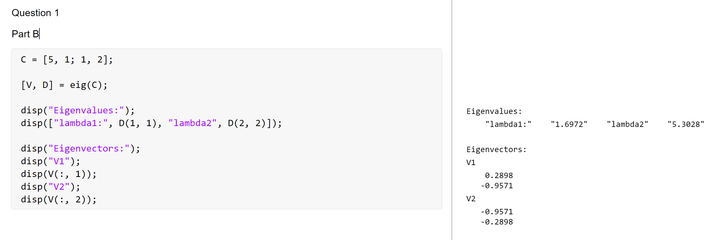

# BSS Lecture Codes
## Reza Sameni
## Emory University Department of Biomedical Informatics

A short lecture of blind-source separation algorithms with practical examples in Matlab
### Student Name: Mingzhe Hu   
### Student Email: mhu58@emory.edu  
***
### Question 1  
##### Part A    
  

##### Part B  
  
As we can see that Part A and Part B have the same result.  
  
### Question 2
#### Part A & B  
Principle Eigenvalue: 5.3028  
Principle Eigenvector: [0.9571, -0.2898]  
