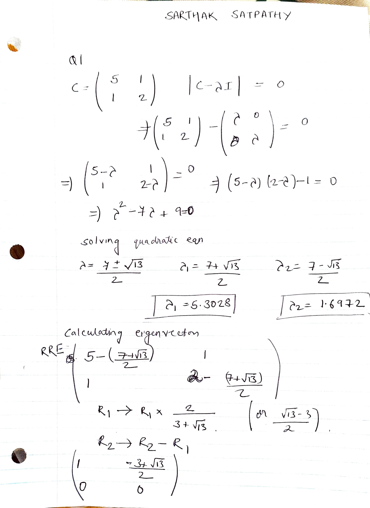
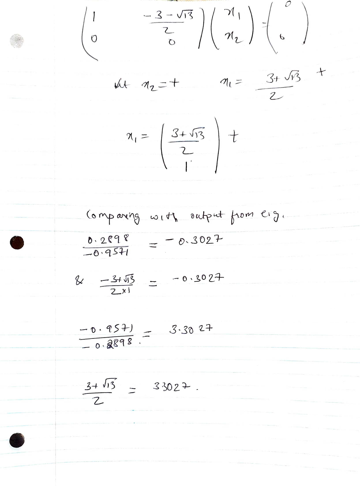
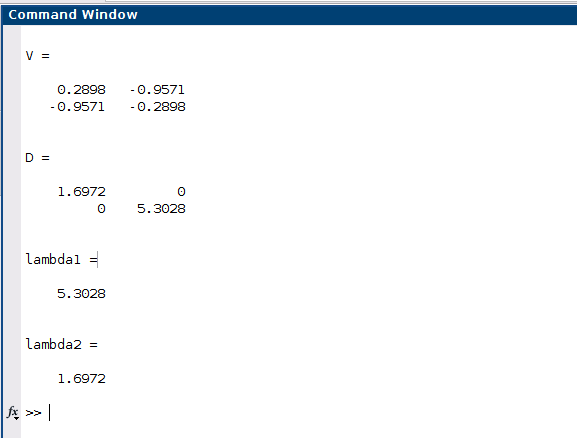
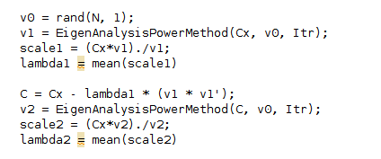
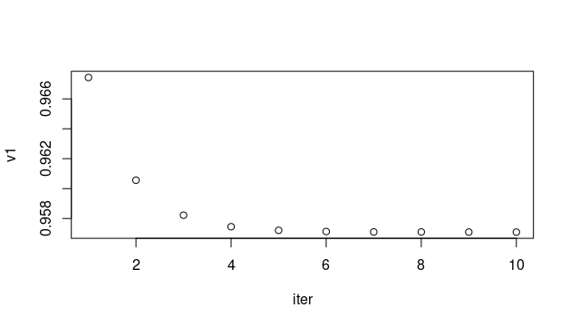
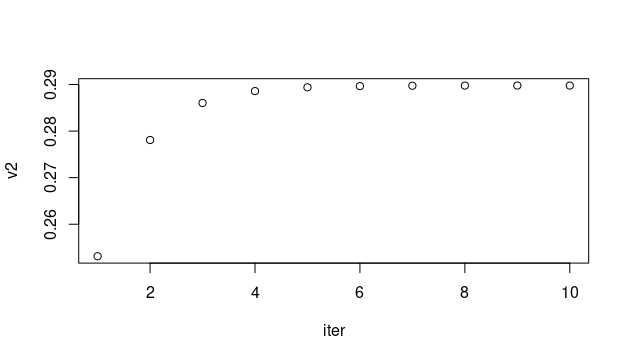
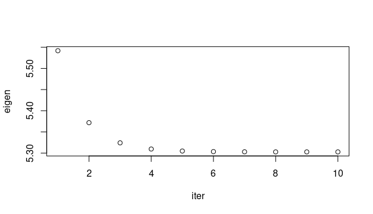

# BSS Lecture Codes
## Reza Sameni
## Emory University Department of Biomedical Informatics

A short lecture of blind-source separation algorithms with practical examples in Matlab

### Student Name: SARTHAK SATPATHY
### Student Email: sarthak.satpathy@emory.edu
***
### Question 1
#### Part A

#### Part B
The values were similar upto the 4th decimal point for the eigenvalues. The ratio of eigenvectors obtained from the eig function has been compared in the notes above.
…
***
### Question 2
#### Part A

The lambda 1 and lamda 2 were obtained with iterations = 100 and the C matrix defined above in Q1. The results were similar.
#### Part B 

…
***
### Question 3
#### Ex 01
In the Ex01 script, the modification was made to the cut-off threshold for the eigenvalue. The aim of the script was to obtain compressed values for the signals from an EEG. The last column on ECG was more discrete than other channels. The channel means were first removed. followed by computing the covariance matrix, its eigenvalue decomposition, decorrelating the samples, choosing the number of eigenvalues to keep based on partial energy and total energies. Finally, based on the threshold, a compressed version of input channels was obtained and plotted. The default value was 99.9 and the values were varied as 90, 95, 98, 99, 99.9, 99.99 where the number of eigenvalues to keep changed to 2, 2, 5, 8, 19 and 24. The lower thresholds showed fewer fluctuations for compressed samples. With lower thresholds, the compressed values were almost a straight line without any fluctuations.
#### Ex 02
The Ex 02 script performs the eigenvalue computation using the Power method by implementing a custom function written by Dr. Sameni. The first step was to simulate a 3 channel signal with 1000 time points using normally distributed random variables. For the signals,  a covariance matrix was created. This covariance matrix underwent an eigenvalue decomposition by the closed-form calculation using the eig function versus the numerically calculated  eigenvectors and eigenvalues by power method. For the power method, the number of iteration, an initial guess (v0) and the covariance matrix were input. The step involved multiplying the matrix with v0 and dividing by the square root of v0 and transformed v0. The v is updated and is the initial vector for the next iteration. Iterating this for the specified iterations. In the case of the non-leading eigenvalues the difference of the covariance matrix with lambda 1 (leading eigenvalue ) and the product of v and transposed v from the previous step. 
#### Ex 03
The Ex 03 script performs compares three ICA methods Fastsica, JADE and SOBI. The input dataset by default was the simulated dataset for 3 channels. However, for better understanding the textbook EEG data was also implemented. In terms of the implementation, JADE and SOBI are similar in taking only the PCA stage. The Fastica algorithm needs the input about the deccorelation approach  (symmetric or deflated), and the non-linearity approach (the implementation used tanh) and number of ICA stages. JADE and Fastsica gave similar sources which is sinusoidal curve with lower and higher frequency for 1 and 2 and a linear fluctuating increase and a sharp drop in signal for channel 3. The FASTICA output changed with change in the non-linearity approach. None of the four non-linearity approach gave sources similar to JADE and SOBI. The inferences for the simulated data was easier to make and the sources obtained gave closed form functions, However, the EEG data was very cluttered. 
#### Ex 04
The script  Ex 04 s used to remove EOG signals from EEG signals. JADE and NSCA methods are used for removing the EOG noise and results are compared. The independence of EOG and EEG are evaluated. followed by separating the signal different components , removing the noise and making a signal without noise with the intended EEG signal.  The reconstructed signals when JADE and NSCA were utilized were plotted.
#### Ex 05
[Your report]

…
***
### Question 4
#### Part A

Article: Cao, L. J., Chua, K. S., Chong, W. K., Lee, H. P., & Gu, Q. M. (2003). A comparison of PCA, KPCA and ICA for dimensionality reduction in
support vector machine. Neurocomputing, 55(1-2), 321-336. DOI: https://doi.org/10.1016/S0925-2312(03)00433-8

Topic: Relationship between ICA and machine learning algorithms

Report:
Support Vector Machine is a supervised learning algorithm for classification and regression analysis. It is now commonplace in time-series forecasting. The paper hypothesizes that the SVM with feature extraction using principal component analysis (PCA), kernel principal component analysis (KPCA) and independent component analysis (ICA) outperforms the SVM without these steps. They were also successful in establishing that for their experiments KPCA and ICA are more efficient than PCA. The PCA algorithm involves the linear transformation of each of the input vectors xt. using an orthogonal matrix whose columns are eigenvectors of the covariance matrix. The eigenvectors are arranged in descending order and the first few principal components are of interest. KPCA method maps the input vector to a high dimensional feature space. The linear PCA in this high dimensional feature space would be equivalent to a non-linear PCA in the input vectors. Blind source separation (BSS) methods are developed to identify unknown source signals that are mutually independent of their linear mixtures without the knowledge of their mixing coefficients. Hence, ICA, a BSS example, involves two preprocessing steps: making input vectors zero mean and whitening the input variable.  The un-mixing matrix is calculated by maximizing negentropy. The advantage of ICA over PCA is that the components are statistically independent and not merely uncorrelated and the use of unmixing matrix rather than the orthogonal matrix. The authors used sunspot, Santa Fe and a couple of financial datasets. The performance was evaluated primarily by normalized mean square error(NMSE) and eventually also by CPU usage. The key takebacks are that NMSE was lower for ICA and KPCA than PCA. However, the reduced error for KPCA was at the cost of computation. 

