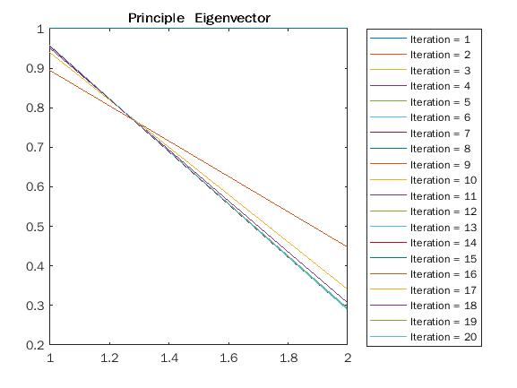
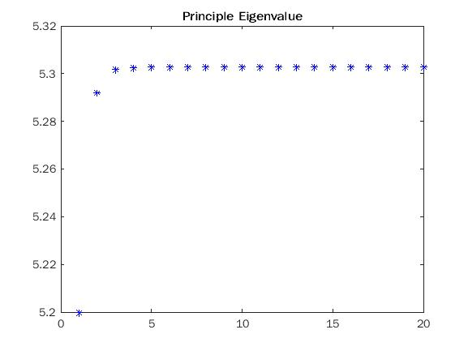

# BSS Lecture Codes
## Reza Sameni
## Emory University Department of Biomedical Informatics

A short lecture of blind-source separation algorithms with practical examples in Matlab
### Student Name: Mingzhe Hu   
### Student Email: mhu58@emory.edu  
***
### Question 1  
##### Part A    
  

##### Part B  
  
As we can see that Part A and Part B have the same result.  
  
### Question 2
#### Part A & B  
```matlab
function [v,lambda] = EigenAnalysisPowerMethod(A, v0, N)
% An implementation of the Power method for eigenvalue decomposition and
% visualization
%
% Inputs:
%   A: A square matrix
%   v0: An initial non-zero (random) vector, which matches in dimension with A
%   N: The number of power iterations
% Output:
%   v: An estimate of the leading eigenvalue after N iterations
%
% Mingzhe Hu
% Nov 2021

%initial vector
v = v0(:);
f1 = figure;
f2 = figure;
for k = 1 : N
    set(0, 'CurrentFigure', f2)
    %figure(2)
    txt = ['Iteration = ',num2str(k)];
    plot(v, 'DisplayName', txt);
    title("Principle  Eigenvector")
    legend("show", "Location", "eastoutside");
    hold on;
    v = A * v;
    y = A*v;
    l=y'*v;
    m=v'*v;
    % eigenvalue
    lambda =l/m;
    % approximate the next eigenvectvor
    %figure(1)
    set(0, 'CurrentFigure', f1)
    plot(k,lambda,'*b');
    title("Principle Eigenvalue")
    hold on;
    v = v / sqrt(v' * v);
end
disp(["Principle Eigenvalue:", num2str(lambda)]);
disp("Principle Eigenvector:");
disp(-v);
```
Principle Eigenvalue: 5.3028  
Principle Eigenvector: [0.9571, -0.2898]  
 
 
  
### Question 3  
#### Part A & B  
The changes are made directly on the original files.  
###### Ex01  
In this example. The parameter we changed is the ECG signal with the signal source changed from one to two. We compressed the signal through principal component analysis. First, a low-pass filter removes the low-pass component of the signal and makes the average value of all signal channels become zero. Then we calculated the covariance matrix of the signal and extracted the eigenvalues ​​and eigenvectors. By sorting the eigenvalues, we use a threshold to retain only the eigenvalues ​​with the most information. The compressed data still retains most of the information of the original signal.
