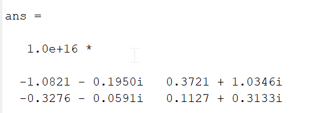
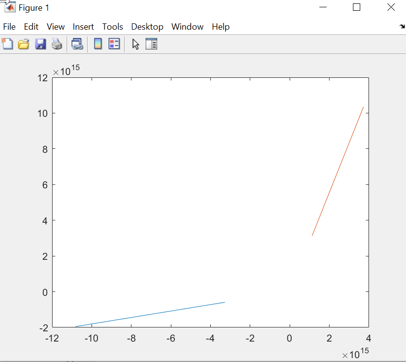
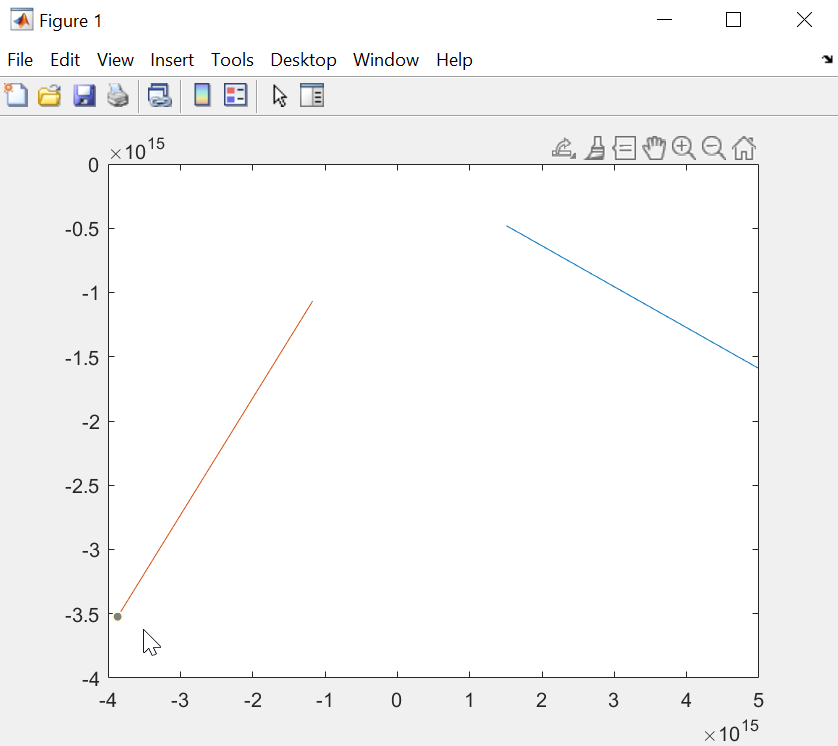

# BSS Lecture Codes
### Xueyun Liu 
### xliu336@emory.edu

### Question 1
#### Part A

#### Part B

### Question 2
#### Part A

#### Part B

### Question 3
#### Part A

### Question 4 
Paper: “Multichannel electrocardiogram decomposition using periodic component analysis.” 
Summary: Electrocardiogram (ECG) has rich signal information in the temporal structure.  So it is more appreciate to measure extracted signal periodically from both clinically and mathematically than independence.  Therefore, the independent component analysis (ICA) is not ideal method to use to analysis the ECG recording.  The idea of this method is to find any periodic structure that can be synchronous with the reference ECG R peaks extracted from a suitably clean ECG reference. In this paper they are using this method to remove maternal ECG artifacts from fetal ECG recordings. This paper proposed use periodic component analysis (πCA) to generate this generalized eigenvalue decomposition for the decomposition the multichannel ECG recoding, so it can extract a periodic components for a certain desired ECG signal from a set of multichannel recording. ECG have RR-period deviation of up to 20%; therefore, we cannot use constant period π to describe the ECG’s periodicity.  This is detected by R-peaks of ECG, a linear phase φ(t) ranged from –π to π for each ECG sample, with the R peak being fixed at φ(t) = 0.  Then the constant time lag τ need to updated to the time-lag τt which is calculated from φ(t) from beat to beat as well.  Then the generalized eigenvalue decomposition (GEBD) pair with the eigenvector ranked corresponding generalized eigenvalue in descending order.  The desired signal vector is sorted according to the amount of their periodicity with respects to R-peaks of ECG. Then the covariance matrices of mother and fetus is assigned.  And finally, the matrix used in the GEVD is set to maternal matrix if the most periodic components with respect to the maternal ECG, or the matrix set to fetal matrix if the most periodic components with respect to the fetal ECG, or set to the maternal matrix subtract from fetal matrix if the most periodic components with respect to the maternal ECG while being the least periodic components with respect to the fetal ECG.  
### Pseudo-code
